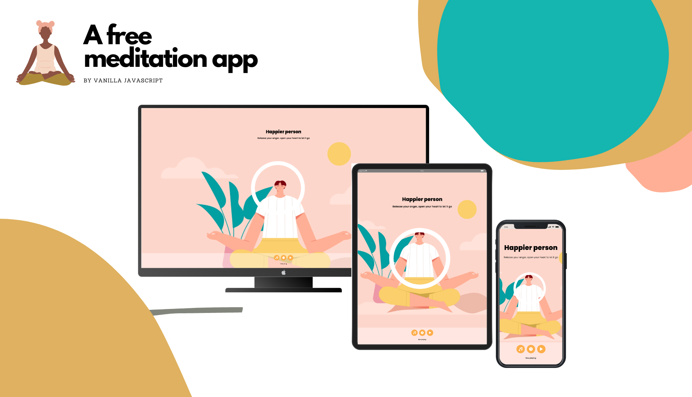

# Meditation App
A meditation app built with vanilla javaScript.
Choose your favorite song and a suitable timming option, then start to meditate.

## Installation
Check out the project through the link: https://meditation-relaxation-app-phuongvu0804.vercel.app/
Or run it locally by the following commands:
+ git clone https://github.com/phuongvu0804/meditation-app.git;
+ cd meditation-app
+ open index.html file

## Usage
+ Choose your favorite song.
+ Choose your suitable timming option.
+ Click play button to start the meditation.

+ Song can be switched during the meditation.
+ Timming can be switched without changing/ replaying the current song.
+ The meditation can be paused by clicking the pause button.

## Attribution
The following sources have been used for reference purposes.
+ [Dribble]:
    - https://dribbble.com/shots/15565023-Woman-Yoga-Meditation-Illustration
    - https://dribbble.com/shots/18454216-Hiling-Meditation-Mobile-App
+ [CSS-tricks] https://css-tricks.com/how-to-create-an-animated-countdown-timer-with-html-css-and-javascript/ 
